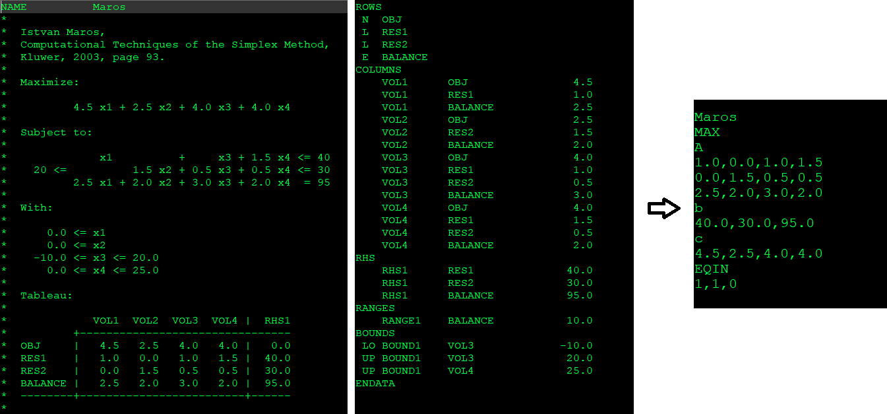

# MPS file format converter 

## Description
This solution converts mps linear programming data files into tables that can be imported in Matlab, excel etc. Each exported file names the problem and the problem type in the first two lines and then there are four tables:
1. Table A which contains the coefficients of the linear equations.
2. Vector b which contains the coefficients of the Righ-Hand-Side.
3. Vector c which contains the coefficients of the objective function.
4. The symbol of each equation where 1 for "lower than", 0 for "equal" and -1 for "greater than".

### MPS input example

	NAME          Maros
	*
	*  Istvan Maros,
	*  Computational Techniques of the Simplex Method,
	*  Kluwer, 2003, page 93.
	*
	*  Maximize:
	*
	*          4.5 x1 + 2.5 x2 + 4.0 x3 + 4.0 x4
	*
	*  Subject to:
	*  
	*              x1          +     x3 + 1.5 x4 <= 40
	*    20 <=          1.5 x2 + 0.5 x3 + 0.5 x4 <= 30
	*          2.5 x1 + 2.0 x2 + 3.0 x3 + 2.0 x4  = 95
	*
	*  With:
	*
	*      0.0 <= x1
	*      0.0 <= x2
	*    -10.0 <= x3 <= 20.0
	*      0.0 <= x4 <= 25.0
	*
	*  Tableau:
	*
	*             VOL1  VOL2  VOL3  VOL4 |  RHS1
	*          +--------------------------------
	*  OBJ     |   4.5   2.5   4.0   4.0 |   0.0
	*  RES1    |   1.0   0.0   1.0   1.5 |  40.0
	*  RES2    |   0.0   1.5   0.5   0.5 |  30.0
	*  BALANCE |   2.5   2.0   3.0   2.0 |  95.0
	*  --------+-------------------------+------
	*
	ROWS
	 N  OBJ
	 L  RES1
	 L  RES2
	 E  BALANCE
	COLUMNS
		VOL1      OBJ                4.5
		VOL1      RES1               1.0
		VOL1      BALANCE            2.5
		VOL2      OBJ                2.5
		VOL2      RES2               1.5
		VOL2      BALANCE            2.0
		VOL3      OBJ                4.0
		VOL3      RES1               1.0
		VOL3      RES2               0.5
		VOL3      BALANCE            3.0
		VOL4      OBJ                4.0
		VOL4      RES1               1.5
		VOL4      RES2               0.5
		VOL4      BALANCE            2.0
	RHS
		RHS1      RES1              40.0
		RHS1      RES2              30.0
		RHS1      BALANCE           95.0
	RANGES
		RANGE1    BALANCE           10.0
	BOUNDS
	 LO BOUND1    VOL3             -10.0
	 UP BOUND1    VOL3              20.0
	 UP BOUND1    VOL4              25.0
	ENDATA

### Tables export example:

	Maros
	MAX
	A
	1.0,0.0,1.0,1.5
	0.0,1.5,0.5,0.5
	2.5,2.0,3.0,2.0
	b
	40.0,30.0,95.0
	c
	4.5,2.5,4.0,4.0
	EQIN
	1,1,0

## Features
- The user interface is minimal, targeting in the easiest User eXperience.
- The conversion is done by a jar application that takes no arguments
- Multiple .mps files can be converted at once, simply by putting them in the input directory
- The converter scraps the comments to identify if the problem is minimization/maximization
- The export format can be customized by changing the class MpsWriter

## Installation
1. Clone the repository using `git clone https://github.com/tanastasiadis/mps-linear-programming-converter`
2. Install JDK13 from [here](https://jdk.java.net/13/)
3. Make sure the command `java -version` returns java version "13.x.x"

## Usage
1. Place the mps files in the input directory
2. Execute the application (see below)
3. Get the converted files from the output directory

### Execution command under windows
`java -jar dist\mps_converter.jar`

### Execution command under Linux
`java -jar dist/mps_converter.jar`

## Resources
- The MPS data format can be found [here](https://en.wikipedia.org/wiki/MPS_(format) ) and [here] (http://plato.asu.edu/cplex_mps.pdf)
- The samples files provides are found [here](https://people.sc.fsu.edu/~jburkardt/datasets/mps/mps.html)
- More MPS files can be found [here](http://www.netlib.org/lp/data/index.html)

## Contribute
Pull requests, bug reports, and feature requests are welcome.

## License
This software is under MIT licence.
